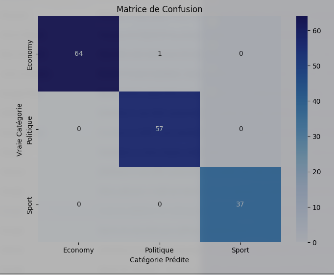

# African News Classifier

[](https://www.python.org/)
[](https://scikit-learn.org/)
[](INSERT_YOUR_COLAB_LINK_HERE)

##  Project Overview
 This project implements an **end-to-end Machine Learning pipeline** to categorize news articles relevant to the Central African region (in this case Cameroon) into distinct classes: *Politics, Economy, Sports, ...*.

This project shows a complete **Data Engineering** workflow, from scraping real-time data using google `gnews` to training a discriminative model using TF-IDF vectorization.

## The Pipeline

### 1. Data Collection 
Data was obtained using the Google News API, targeting specific queries to build a localized dataset.
- **Source:** Real-time news aggregation.
- **Context:** Focus on Cameroonian keywords (e.g., *"Lions Indomptables"*, *"Économie Cameroun", ...*).

### 2. Preprocessing
To reduce noise and dimensionality in the dataset, the raw text undergoes cleaning using `NLTK`:
- **Normalization:** Text lowercasing and punctuation removal.
- **Stop-words Removal:** Filtering out common French words to focus on semantic content.
- **Tokenization:** Splitting text into individual semantic units.

### 3. Mathematical Modeling (TF-IDF)
Text data is converted into numerical vectors using **Term Frequency-Inverse Document Frequency**, `TF-IDF`. This statistical measure evaluates how relevant a word is to a document in a collection and classification is performed.

$$w_{i,j} = tf_{i,j} \times \log\left(\frac{N}{df_i}\right)$$

*Where $N$ is the total number of articles and $df_i$ is the number of articles containing term $i$.*


## Results & Performance
The model was evaluated on a test set and produced the following.


### Confusion Matrix



 The matrix shows that the model effectively distinguishes 'Sports' from 'Politics', though some overlap exists between 'Economy' and 'Politics' due to factors like shared vocabulary.*

## How to Run

1. **Clone the repository:**
   ```bash
   git clone https://github.com/JeffreyYAJ/African-news-classifier.git
   cd African-news-classifier
   ```

2. **Install dependencies:**
   ```bash
   pip install -r requirements.txt
   ```
Run the pipeline from the jupyter notebook.

## Tools Used
- Pandas: Data manipulation.
- GNews: Data extraction.
- NLTK: Natural Language Processing.
- Scikit-Learn: Model training and evaluation.
- Matplotlib/Seaborn: Data visualization.
